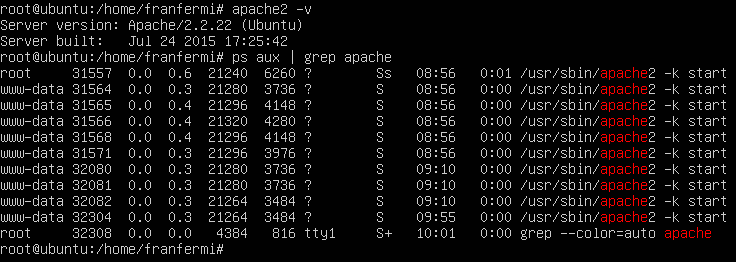
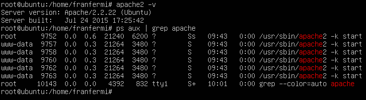
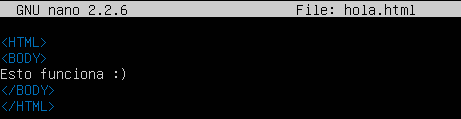
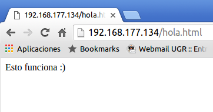

#Práctica 1. Preparación de las herramientas.

##Versión de Apache instalado y en ejecución##

apache2 -v (versión apache)

ps aux | grep apache (comprobar que se encuentra en ejecución)

###Máquina 1###

###Máquina 2###

##Prueba de funcionamiento de Apache##

Fichero HTML hola.html

Comprobamos el funcionamiento de Apache accediendo a dicho archivo usando cURL

