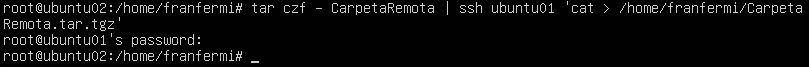
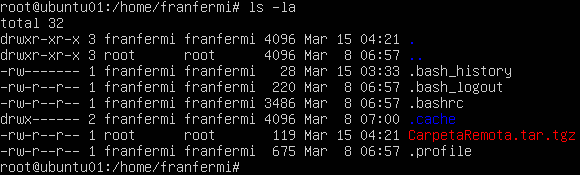
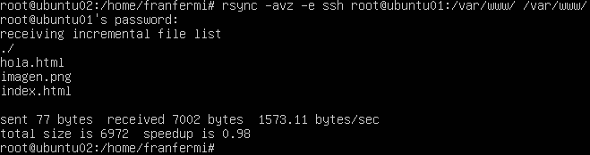
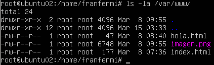

#Práctica 2

##Crear un tar con ficheros locales en un equipo remoto

tar czf - directorio | ssh equipodestino 'cat > ~/tar.tgz'

Ahora comprobamos que se ha creado en la máquina principal.

##Instalar la herramienta rsync

rsync -avz -e ssh root@maquina1:/var/www/ /var/www/

Comprobamos que el contenido en /var/www/ de la máquina 1 y la máquina 2 es el mismo.

Máquina 1:

Máquina 2:

##Acceso sin contraseña para ssh

ssh-keygen -t dsa

Copiamos la clave pública a la máquina principal y comprobamos que podemos acceder a la máquina principal 
sin necesidad de introducir la contraseña.

##Programar tareas con crontab

Añadimos la tarea editando el fichero /etc/crontab.

Comprobamos las tareas a realizar por el usuario root.

