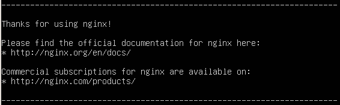
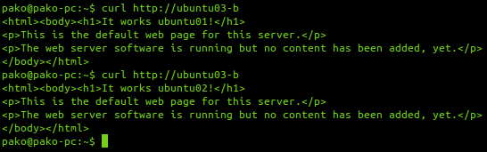
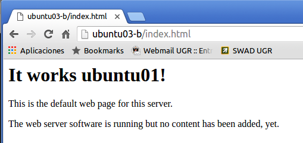
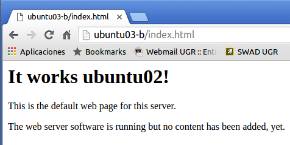
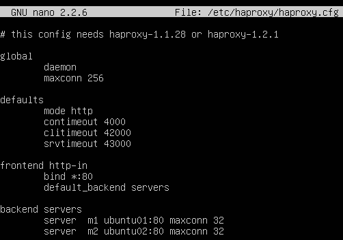
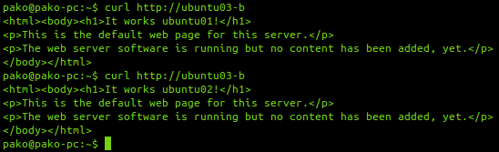

#Práctica 3

##Instalación nginx

>cd /tmp/

>wget http://nginx.org/keys/nginx_signing.key

>apt-key add /tmp/nginx_signing.key

>rm -f /tmp/nginx_signing.key

-Añadimos el repositorio

>echo "deb http://nginx.org/packages/ubuntu/ lucid nginx" >> /etc/apt/sources.list

>echo "deb-src http://nginx.org/packages/ubuntu/ lucid nginx" >> /etc/apt/sources.list

-Instalamos nginx

>apt-get update

>apt-get install nginx

###Balanceo de carga con nginx

-Archivo de configuración nginx

-Para comprobar el funcionamiento del balanceador, realizamos cURL desde la máquina anfritiona con la IP del balanceador.

Desde el navegador

##Instalación haproxy

>apt-get install haproxy

###Balanceo de carga con haproxy

-Configuración de haproxy como balanceador

>cd /etc/

>cd haproxy/

>ifconfig

>nano haproxy.cfg

-Para comprobar el funcionamiento del balanceador, realizamos cURL desde la máquina anfritiona con la IP del balanceador, 
pero antes tenemos que detener el servicio de nginx para que deje libre el puerto 80.

-Ahora si realizamos las peticiones

Desde el navegador

