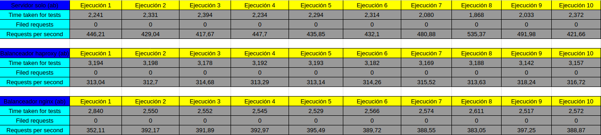
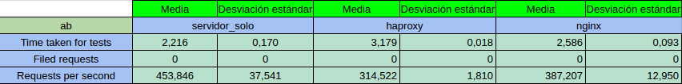
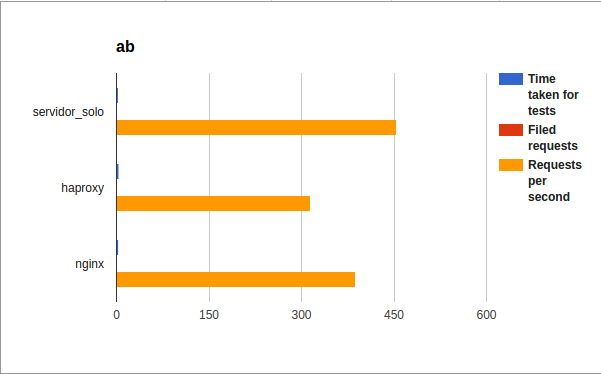
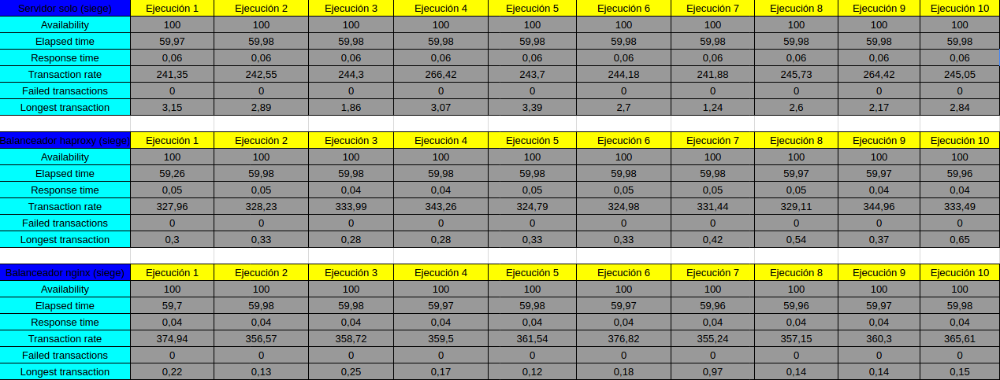
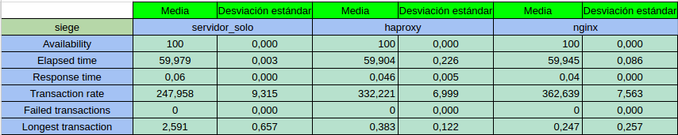
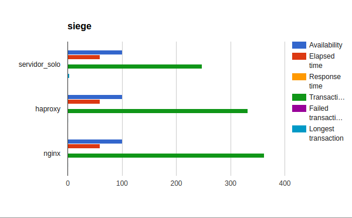

#Prática 4. Comprobar el rendimiento de servidores web.

##Comprobar el rendimiento de servidores web con Apache Benchmark.

Para comprobar el rendimiento con Apache Benchmark usameos en el terminal el siguiente comando:

>ab -n 1000 -c 10 http://www.example.com/test.html

Para realizar el Benchmark tenemos que acceder a la máquina que queremos comprobar su rendimiento
desde una máquina fuera de la granja web.
Se realizarán 10 pruebas a las distintas máquinas, servidor_solo, balanceador con servicio haproxy y 
balanceador con servicio nginx.

Comandos usados para el Apache Benchmark:

>for i in {0..9}; do ab -n 1000 -c 5 http://ubuntu01/hola.html > bateriaPruebas/ab/Servidor_Solo_ab_$i.txt; done

>for i in {0..9}; do ab -n 1000 -c 5 http://ubuntu03-b/hola.html > bateriaPruebas/nginx/Nginx_ab_$i.txt; done

>for i in {0..9}; do ab -n 1000 -c 5 http://ubuntu03-b/hola.html > bateriaPruebas/haproxy/Haproxy_ab_$i.txt; done

En la carpeta bateriasPruebaP4 podemos encontrar los resultados obtenidos de cada prueba con cada servicio.

-Los resultados son los siguientes:

##Comprobar el rendimiento de servidores web con Siege.

Para comprobar el rendimiento con Apache Benchmark usameos en el terminal el siguiente comando:

>siege -b -t60S -v http://www.ugr.es

La opción -t puede tomar los siguientes valores:

  • -t60S (60 segundos)
  
  • -t1H (1 hora)
  
  • -t120M (120 minutos)
  
Para realizar el Benchmark tenemos que acceder a la máquina que queremos comprobar su rendimiento
desde una máquina fuera de la granja web.
Se realizarán 10 pruebas a las distintas máquinas, servidor_solo, balanceador con servicio haproxy y 
balanceador con servicio nginx.

Comandos usados para Siege: 

>for i in {0..9}; do siege -b -t60S -v http://ubuntu01/hola.html > bateriaPruebas/servidor_solo/Servidor_Solo_siege_$i.txt; done

>for i in {0..9}; do siege -b -t60S -v http://ubuntu03-b/hola.html > bateriaPruebas/haproxy/Haproxy_siege_$i.txt; done

>for i in {0..9}; do siege -b -t60S -v http://ubuntu03-b/hola.html > bateriaPruebas/nginx/Nginx_siege_$i.txt; done

En la carpeta bateriasPruebaP4 podemos encontrar los resultados obtenidos de cada prueba con cada servicio.

-Los resultados son los siguientes:

##Conclusión

Con respecto a Apache Benchmark, he comprobado que a nivel de peticiones por segundo el servidor_solo es el que mayor cantidad 
de ellas es capaz de procesar, seguido del balanceador con nginx y del balanceador con haproxy respectivamente.
En los tiempos de realización del test, el servidor_solo es el que de nuevo obtiene mejor resultado, seguido de nginx y haproxy 
como anteriormente.

Con respecto a Siege, he observado que los 3 tienen una disponibilidad del 100%, en los tiempos de respuesta están muy igualados, 
nginx es el que obtiene menor tiempo de respuesta, seguido muy de cerca de haproxy y luego del servidor_solo.
En la tasa de transacciones, de nuevo nginx es el que mayor transacciones por segundo realiza delante de haproxy y del servidor solo
respectivamente, de este último tiene una diferencia de más de 100 transacciones.
Según el tiempo de transacción mas largo realizado, el que peor resultado obtiene es el servidor_solo obteniendo un resultado más
del doble en comparación con haproxy y nginx.
