#Práctica 5. Replicación de bases de datos MySQL

##Crear una BD e insertar datos

Para el desarrollo de la práctica me he creado una base de datos propia y he insertado algunos valores.

Accedemos a MySQL para crear la BD.

>mysql -uroot -p

Mi BD ha sido creada de la siguiente forma.

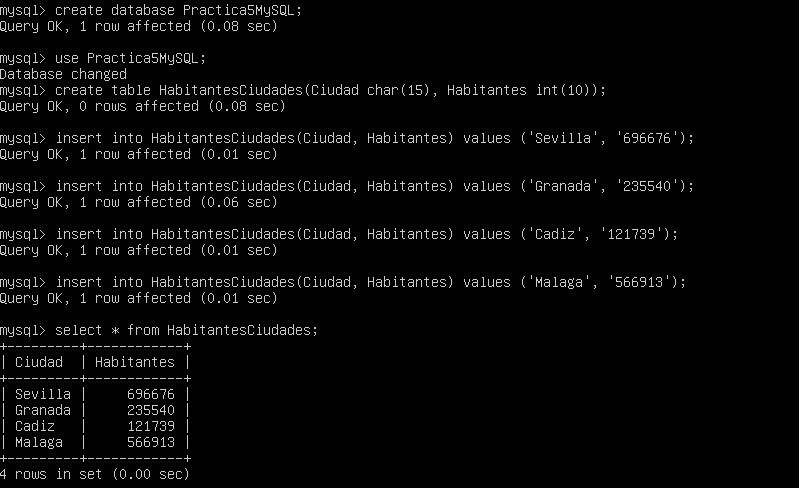

Mi BD se llama Practica5MySQL y mi tabla HabitantesCiudades, compuesta por las columnas Ciudad y Habitantes.

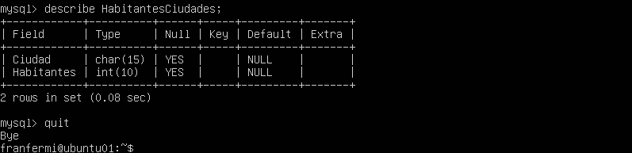

##Replicar una BD MySQL con mysqldump

Antes de realizar una copia de seguridad en el archivo .SQL debemos evitar que durante el proceso se acceda a la BD, para ello bloqueamos la tabla creada.

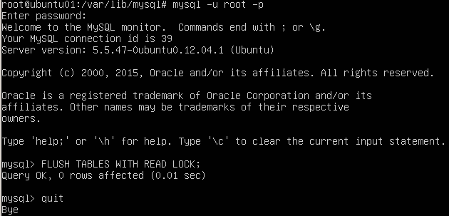

Ahora ya podemos usar mysqldump para realizar la copia de seguridad, la orden la realizamos en la maquina 1 (maestro) en mi caso es ubuntu01.

>mysqldump ejemplodb -u root -p > /root/ejemplodb.sql

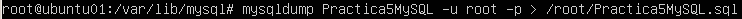

Una vez realizada desbloqueamos la tabla anteriormente bloqueada.

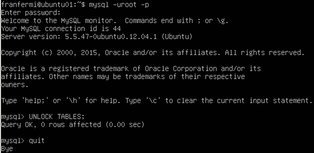

Cambiamos a la máquina 2 (esclavo) en mi caso ubuntu02 para copiar el archivo .SQL con los datos guardados del maestro.

>scp root@maquina1:/root/ejemplodb.sql /root/

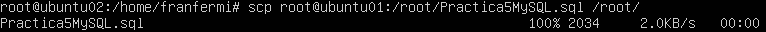

Ahora ya tenemos el archivo en la máquina esclavo pero con texto plano, es decir, con las sentencias necesarias para la creación de nuestra BD, un ejemplo del archivo
es el siguiente:

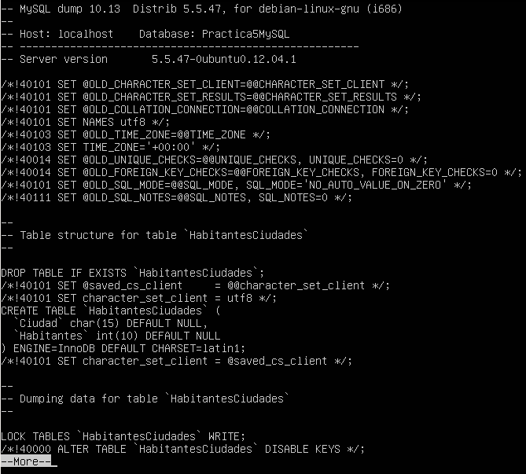

Mysqldump no crea la BD para ello tenemos que crear nuestra BD y asignarle el archivo .SQL.

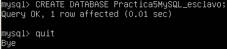

Ahora ya podemos restaurar a la BD creada el contenido del archivo .SQL.

Una vez restaurada la BD en la máquina esclavo, comprobamos que el contenido de la BD es el mismo que es de la máquina maestro.

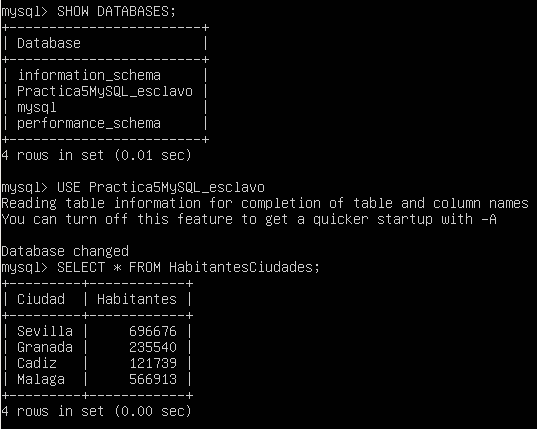

##Replicación de BD mediante una configuración maestro-esclavo.

La replicación anterior funciona perfectamente, pero necesitamos de una persona que esté realizando las operaciones anteriores de forma
continuada y manual, para evitar eso se realiza una configuración maestro-esclavo para que dichas operaciones se realicen de forma automática.

Lo primero es comprobar que en ambas máquinas tenemos instalada la misma versión de mysql.

Una vez comprobada la versión procedemos a configurar el archivo de configuración /etc/mysql/my.cnf de la máquina maestro.

La configuración es la siguiente:

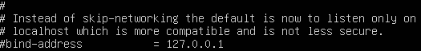
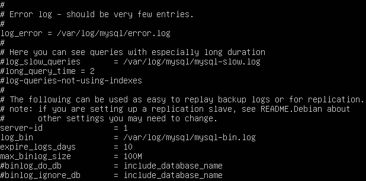

Por último después de guardar los cambios, reiniciamos el servicio:

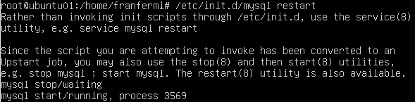

Ahora procedemos a configurar la máquina esclavo, con los cambios similares al maestro con la diferencia de server-id=2.

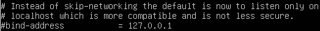
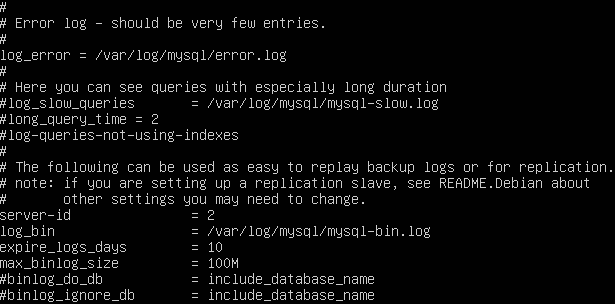

Guardamos cambios y reiniciamos el servicio.

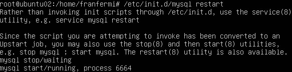

Ahora volvemos a la máquina maestro para crear un usuario y darle permisos de acceso para la replicación.
Por último, obtenemos los datos de la BD que vamos a replicar para posteriormente usarlos en la configuración del esclavo.

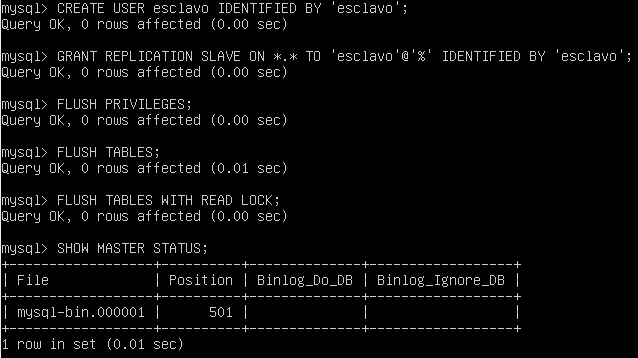

Volvemos a la máquina esclavo, entramos en mysql y la damos los datos del maestro.
Por último arrancamos el esclavo. 

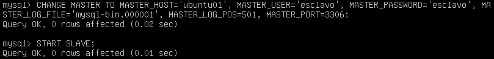

En el maestro, volvemos a activar las tablas que anteriormente bloqueamos.
Y para asegurarnos que funciona correctamente, realizamos los siguiente en mysql:

>mysql> SHOW SLAVE STATUS\G

Y nos fijamos en que “Seconds_Behind_Master” es distinto de “null”.

Para acabar, comprobamos que insertando una nueva fila a la tabla en la máquina maestro, automáticamente aparece en la máquina esclavo.

-Maestro

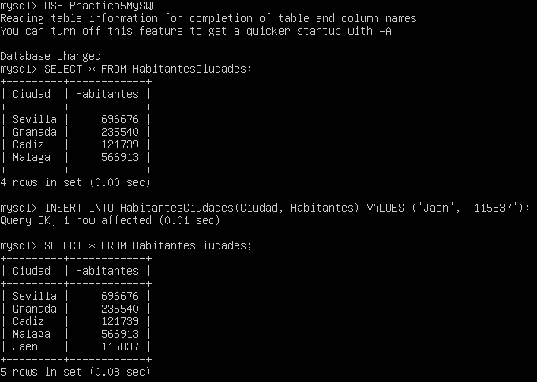

-Esclavo

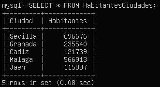

